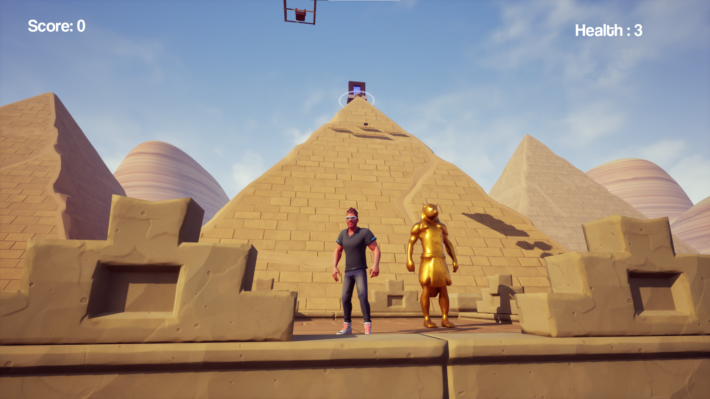
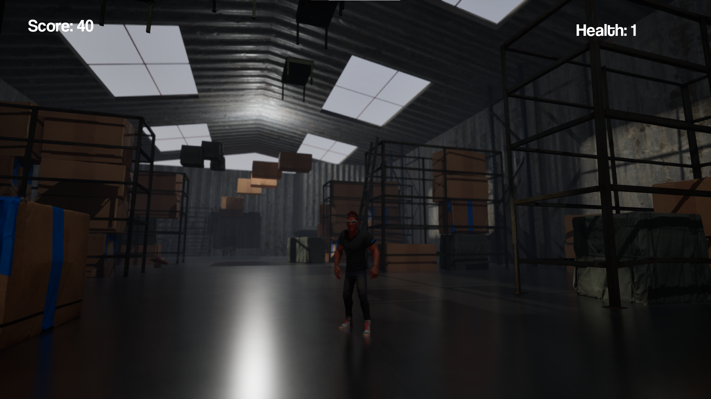

# M-GAM-907

M-GAM-907 is a 2 weeks long student Unreal Engine 5 project made for Epitech.
Inspired by Only Up, the game has currently 2 playable levels.

## EXE generation

You can launch the EpitechFirstBP.uproject file and build the wanted package for your playing platform.

You can also play directly in the editor if you don't want to do a full build.

## How to play

Z, Q, S, D for movement
R to respawn at the last checkpoint (golden statues in level 1).

